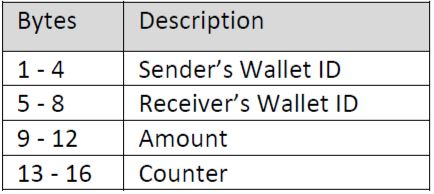

# Smart_Wallet_App

The Smart Wallet App is designed to run on a Trusted Platform. Each instance of the App will securely maintain the following parameters:
- Wallet ID (WID): A unique number identifying the Wallet instance (Set to last 4 digits of your Student ID).
- Balance: Initialized to 0.
- Bank Secret Key (KBank): An AES 256 bit key issued by the Bank. Used to transfer funds between wallets.
- Wallet Secret Key (KWallet): An AES 256 bit key (unique per wallet) generated as follows:
KWallet = SHA-256(Student_ID)
For example SHA-256(56789859) = B751237F9A7ED3530A67CEBD5E18816387C0A372A9E1D424A5F276A997FB6252
Input is in ASCII, output is in hexadecimal
- A table to store list of Synchronized wallets.

The wallet should implement the following UIs:

UI1: Receiving funds from the bank
The bank issues an Electronic Money Draft (EMD) which is entered on the Wallet UI to deposit the funds. The EMD is simply the amount encrypted using the Wallet Secret Key (KWallet).
EMD = AES-256(Amount, KWallet)
For example AES-256(00000000000000000000000000000123 , CF959C7BFC4FB5792AA25457578EF9E8B78E3558A8B7BF6A92338397B5F4639D) = D8D9752ED5CCCB9F460FB8D6EB86A984
All numbers are in hexadecimal. Amount is $291 (hex 123).
The UI will prompt the user to enter the EMD, decrypt it using the Wallet Secret Key, and update the amount in the Wallet.

UI2: Synchronizing two wallets
Wallets will need to register with each other before they can transfer funds. The synchronization protocol is described as follows:
1. Wallet A will generate a token XAB = AES-256(WIDA, WIDB, amount=0, counter=0) and display it on the screen (in Hex). Please refer to Token Structure in Appendix I.
2. Wallet B will collect XAB from the user and add a record to the internal table used to store synchronized wallets. The record contains the WIDA and the incremented counter value which is (0+1).
3. Steps 1 -2 are repeated for Wallet B to Wallet A synchronization.

UI3: Sending Funds
The user of Wallet A will use this interface to transfer funds to Wallet B. The user will enter the amount and the receiving Wallet ID. The wallet balance will be updated accordingly.
A token will be generated X = AES256(WIDA, WIDB, Amount, CB), where CB is the counter value associated with WIDB in Wallet A’s table. CB is incremented by 1 afterwards.

UI4: Receiving Funds
The user of Wallet B will enter the value of token X on this UI. The token is decrypted and verified by making sure that WIDB is in the receiver’s field and that the counter matches that in the record associated with WIDA. The wallet balance is updated accordingly and CA is incremented by 1.
Appendix I: Token Structure
Token X is generated by encrypting a single block using AES256. The following table summarizes the structure of the block:

The following key is used to encrypt the block and generate the token. Token is communicated to the user by displaying it on the screen.
KBank = F25D58A0E3E4436EC646B58B1C194C6B505AB1CB6B9DE66C894599222F07B893
Example: Wallet # 1092 (hex 444) sending $33 (hex 21) to Wallet # 819 (hex 333) for the first time. The token is calculated as follows:
AES-256(00000444000003330000002100000001 , F25D58A0E3E4436EC646B58B1C194C6B505AB1CB6B9DE66C894599222F07B893) = 965390DFD8B18BCD419CA0583896218A
All numbers are in hexadecimal.
